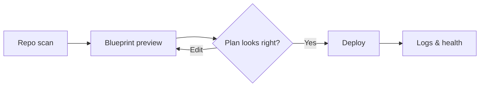

# Smart Deploy

<p align="center">
   
</p>

<p align="center">
   <strong>Smart Deploy</strong> is a preview-driven deployment platform for solo developers.
</p>

<p align="center">
   <a href="LICENSE"></a>
   <a href="https://github.com/anirudh-makuluri/smart-deploy/actions/workflows/ci.yml"></a>
   <a href="https://github.com/anirudh-makuluri/smart-deploy/issues"></a>
   <a href="https://github.com/anirudh-makuluri/smart-deploy/pulls"></a>
   <a href="https://github.com/anirudh-makuluri/smart-deploy/commits/main"></a>
</p>

<p align="center">
   Scan a repo, review a live blueprint of what will run, edit infrastructure files in context, and deploy only after the plan makes sense.
</p>

<p align="center"><em>Preview the deploy. Then ship it.</em></p>

## Highlights

| What you get | Why it matters |
|--------------|----------------|
| Preview-first workflow | See services, routing, and artifacts before anything runs |
| Blueprint view | One place to understand build steps, containers, and traffic flow |
| Inspectable deploy plan | Deploy units, build steps, cloud targets, and routing stay visible before you ship |
| Multi-target deploys | Containers on AWS ECS, static sites on S3 + CloudFront, and GCP paths |
| Live deploy feedback | Stream logs, track run history, and watch health status update in place |

## Table of Contents

- [Highlights](#highlights)
- [The problem](#the-problem)
- [What Smart Deploy does](#what-smart-deploy-does)
- [Workflow](#workflow)
- [Deploy targets](#deploy-targets)
- [Blueprint & preview](#blueprint--preview)
- [Architecture overview](#architecture-overview)
- [Tech stack](#tech-stack)
<!-- - [Local development](#local-development)
- [Documentation](#documentation) -->
- [License](#license)

## The problem

Most deployment tools ask you to commit before you can see the plan.

- A PaaS moves fast, but the real deploy path stays hidden until something breaks.
- Raw cloud tooling gives control, but dumps the whole surface area on you at once.
- Solo developers need a middle path: ship quickly without flying blind.

Smart Deploy is built around preview. You should know what will run, how traffic will flow, and which cloud resources are involved before you press deploy.

## What Smart Deploy does

- **Scans your repository** to detect services, frameworks, and deploy shape
- **Analyzes deploy shape** — single or multi-service, static site, Railpack build, or existing Docker image
- **Renders a preview pipeline** — branch, build units, CodeBuild output, ECS or S3 target, ALB routing, and domain
- **Lets you edit in preview mode** — branch, region, env vars, secrets, and hosted subdomain before deploy
- **Deploys to real cloud primitives** — CodeBuild, ECR, ECS Fargate, ALB, Route 53, S3, CloudFront, and GCP — with logs and history tied to the same workflow
- **Tracks deployment health** with background reconciliation so status reflects what is actually reachable
- **Stores per-deployment secrets** in AWS Secrets Manager for ECS workloads

## Workflow

Smart Deploy is organized around three steps:

1. **Scan & define** — Connect a repo and run Smart Analysis to resolve deploy units and target shape.
2. **Preview** — Open the blueprint, review the deployment path, and adjust config before anything runs.
3. **Deploy** — Start the deploy when the preview looks right, then follow live logs, run history, and health updates.



## Deploy targets

| Target | Best for | What Smart Deploy provisions |
|--------|----------|------------------------------|
| **ECS Fargate** | Server apps, Railpack builds, existing Docker images | CodeBuild → ECR → Fargate task behind a shared ALB |
| **Static sites** | SPAs and static builds | CodeBuild → S3, optional CloudFront invalidation |
| **EC2** | Traditional container-on-VM deploys | EC2 instance, security groups, ALB routing |
| **GCP Cloud Run** | Container workloads on Google Cloud | Cloud Run service from scanned or supplied config |

Custom deployment URLs use Route 53 subdomains (for example `myapp.yourdomain.com`) with wildcard ALB routing on AWS. See [docs/CUSTOM_DOMAINS.md](docs/CUSTOM_DOMAINS.md).

## Blueprint & preview

The blueprint is the center of the product. It answers one question before deploy:

**What exactly is going to happen to this app?**

The preview walks through the full pipeline before anything runs:

- **Auth & resolve ref** — repo, branch, and commit
- **Build** — deploy units, build contexts, and CodeBuild output (ECR images or S3 artifacts)
- **Setup** — region, Fargate networking, or CloudFront bucket
- **Deploy** — runtime env vars (Secrets Manager on ECS), ALB host rules, cache invalidation
- **Done** — hosted subdomain and public URL

Each step surfaces the artifacts involved — Railpack plans, Docker build units, ECS prerequisites, and domain routing — so the deploy path stays inspectable. You can adjust branch, region, env vars, and subdomain from the same preview surface without losing context.

## Architecture overview

| Component | Role |
|-----------|------|
| Next.js app | Auth, dashboard UI, GraphQL/REST APIs, deploy orchestration |
| WebSocket worker | Long-running deploy jobs, log streaming, health reconciliation |
| Supabase | Users, repo metadata, deployment records, and run history |
| SD Artifacts backend | Repo scan, artifact generation, feedback, and cache |
| AWS / GCP APIs | CodeBuild, ECR, ECS, ALB, Route 53, Secrets Manager, S3, CloudFront, Cloud Run |

<!-- The app drives the preview and orchestration layer. The worker executes deploy pipelines and streams progress back to the UI. Terraform stacks under [`infra/`](infra/) provision shared platform prerequisites (ECS cluster, static-site bucket, worker host). -->

## Tech stack

- Next.js 16, React 19, TypeScript
- Tailwind CSS 4, shadcn/ui
- Better Auth, Supabase
- GraphQL (Yoga) + REST API routes
- WebSocket worker for deploy execution
- AWS SDK, GCP client libraries
- Vitest, Playwright

<!-- ## Local development

```bash
git clone https://github.com/anirudh-makuluri/smart-deploy.git
cd smart-deploy
npm install
```

Setup requires Supabase, auth credentials, and a running WebSocket worker. See the guides below — especially [docs/SUPABASE_SETUP.md](docs/SUPABASE_SETUP.md) and [docs/BETTER_AUTH.md](docs/BETTER_AUTH.md).

Sign-in is allowlist-based. Add your email to `approved_users` before signing in locally.

```bash
npm run start-all   # app + worker
# or: npm run dev && npm run ws
```

Open `http://localhost:3000`.

For AWS or GCP deploy paths from a local instance, configure cloud credentials per [docs/AWS_SETUP.md](docs/AWS_SETUP.md) and [docs/GCP_SETUP.md](docs/GCP_SETUP.md).

## Documentation

**Getting started**

- [docs/SUPABASE_SETUP.md](docs/SUPABASE_SETUP.md) — database and schema
- [docs/BETTER_AUTH.md](docs/BETTER_AUTH.md) — authentication
- [docs/FAQ.md](docs/FAQ.md) — common questions

**Deploying apps**

- [docs/AWS_SETUP.md](docs/AWS_SETUP.md) — IAM, CodeBuild, ECS, static sites
- [docs/GCP_SETUP.md](docs/GCP_SETUP.md) — Cloud Run setup
- [docs/CUSTOM_DOMAINS.md](docs/CUSTOM_DOMAINS.md) — Route 53 and deployment URLs
- [docs/MULTI_SERVICE_DETECTION.md](docs/MULTI_SERVICE_DETECTION.md) — how repos are scanned
- [infra/README.md](infra/README.md) — Terraform stacks for platform prerequisites

**Operations & debugging**

- [docs/TROUBLESHOOTING.md](docs/TROUBLESHOOTING.md)
- [docs/ERROR_CATALOG.md](docs/ERROR_CATALOG.md) -->

## License

Smart Deploy is licensed under the Apache License 2.0. See [LICENSE](./LICENSE).

Smart Deploy was created and is maintained by Anirudh Raghavendra Makuluri.

Forks and derivative projects should preserve the required license and attribution notices, and should not imply that they are the official Smart Deploy project unless explicitly authorized.
