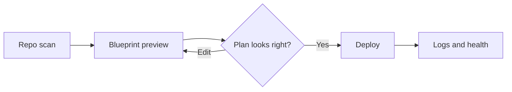
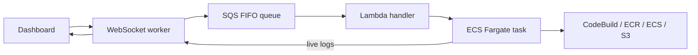

# Smart Deploy

   

   <strong>Smart Deploy</strong> is a preview-driven deployment platform for solo developers.

   
   
   
   
   

   Scan a repo, review a live blueprint of what will run, edit infrastructure files in context, and deploy only after the plan makes sense.

<em>Preview the deploy. Then ship it.</em>

## Highlights

| What you get | Why it matters |
|--------------|----------------|
| Preview-first workflow | See services, routing, and artifacts before anything runs |
| Blueprint view | One place to understand build steps, containers, and traffic flow |
| Smart Analysis | Railpack build plans with optional build verification |
| Multi-target deploys | ECS Fargate for containers, S3 for static sites |
| Live deploy feedback | Stream logs, track run history, and watch health status update in place |
| Queued deploy execution | Each deploy runs as an isolated ECS task, ordered per service via SQS |
| Deployment Agent | Ask about your deployments, history, and runtime health |

## Workflow

1. **Scan and define** — Connect a repo and run Smart Analysis to resolve deploy units and target shape.
2. **Preview** — Open the blueprint, review the deployment path, and adjust config before anything runs.
3. **Deploy** — Start the deploy when the preview looks right, then follow live logs, run history, and health updates.

## Deploy targets

| Target | Best for | What Smart Deploy provisions |
|--------|----------|------------------------------|
| **ECS Fargate** | Server apps, Railpack builds, existing Docker images | CodeBuild → ECR → Fargate task behind a shared ALB |
| **Static sites** | SPAs and static builds (no runtime) | CodeBuild → S3, optional CloudFront invalidation |

## Deployment execution

When you start a deploy, Smart Deploy enqueues the run and executes it on AWS — not on the WebSocket host.

1. The **WebSocket worker** records the run and sends a message to an **SQS FIFO queue** (one in-flight deploy per user/repo/service).
2. A **Lambda** function consumes the queue and launches a **one-off ECS Fargate task** (`deployment-runner.js`).
3. That task runs the pipeline (CodeBuild, ECR, ECS rollout, S3 sync, verification).
4. Live step logs stream back to the UI through the WebSocket worker via an HTTP event bridge.

Provision the queue, Lambda, and deployment worker task with [`infra/smart-deploy-platform`](infra/smart-deploy-platform/README.md) and set `DEPLOYMENT_QUEUE_URL` in `.env`. Roll out worker and Lambda images with `./scripts/update.sh`.

## Documentation

User-facing guides for deploying and debugging your apps:

- **[Documentation home](docs/README.md)** — full index
- **[Getting Started](docs/GETTING_STARTED.md)** — first deployment
- **[Debugging Deployments](docs/DEBUGGING_DEPLOYMENTS.md)** — production issues runbook
- **[Deployment Agent](docs/DEPLOYMENT_AGENT.md)** — AI inspector for your deploys
- **[FAQ](docs/FAQ.md)** · **[Error Catalog](docs/ERROR_CATALOG.md)**

Browse all docs in the app at `/docs`. For AI agents: [`/llms.txt`](/llms.txt) and [`/llms-full.txt`](/llms-full.txt).

## Tech stack

- Next.js 16, React 19, TypeScript
- Tailwind CSS 4, shadcn/ui
- Better Auth, Supabase
- GraphQL (Yoga) + REST API routes
- WebSocket worker for real-time UI, Deployment Agent, and runtime health
- SQS + Lambda + ECS Fargate for queued deployment execution
- AWS SDK (SQS, Lambda, CodeBuild, ECR, ECS, ALB, Route 53, S3, CloudFront, Secrets Manager)
- Railpack + Mise for container builds
- Vitest, Playwright

## License

Smart Deploy is licensed under the Apache License 2.0. See [LICENSE](./LICENSE).

Smart Deploy was created and is maintained by Anirudh Raghavendra Makuluri.

Forks and derivative projects should preserve the required license and attribution notices, and should not imply that they are the official Smart Deploy project unless explicitly authorized.