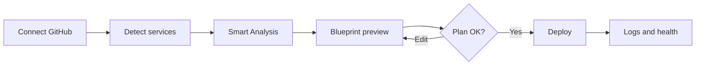

# How It Works

Smart Deploy connects your GitHub repo to AWS through a predictable pipeline: **scan → preview → deploy → monitor**.

## Components you interact with

| Piece | What it does for you |
|-------|----------------------|
| **Dashboard** | Lists repos and deployments |
| **Repo page** | Service catalog, scan, and deploy workspace per repo |
| **Blueprint** | Visual preview of the full deploy path |
| **Deploy workspace** | Live logs, overview, history, and config while deploying or running |
| **Deployment Agent** | Read-only AI that inspects your deployments via tools |

## Behind the scenes

| Component | Role |
|-----------|------|
| **SD Artifacts** | Scans repos, generates Railpack plans, verifies builds, supports improve-scan feedback |
| **WebSocket worker** | Runs long deploy jobs, streams logs, reconciles runtime health |
| **AWS** | CodeBuild, ECR, ECS Fargate, ALB, Route 53, S3, CloudFront, Secrets Manager, CloudWatch |
| **Database** | Stores deployments, scan results, history, and agent conversations |

You do not configure these primitives directly — Smart Deploy orchestrates them from your repo scan and deployment config.

## Scan → plan

1. **Service detection** discovers deployable units (monorepo packages, compose dirs, Dockerfiles, root apps).
2. **Smart Analysis** clones your repo at a commit and runs SD Artifacts:
   - Classifies **deploy shape** (`server`, `static`, `static_build`, `multi`, `existing_docker`)
   - Generates **Railpack plans** (or uses your Dockerfile)
   - Optionally **verifies the build** and attempts repair
3. Results are stored and linked to your deployment as the source of truth for preview and deploy.

See [Smart Analysis](./SMART_ANALYSIS.md) and [Railpack](./RAILPACK.md).

## Preview → configure

The blueprint turns scan results into a five-step pipeline you can read and edit:

1. Auth and resolve ref (repo, branch, commit)
2. Build (deploy units, CodeBuild output)
3. Setup (region, networking or static bucket)
4. Deploy (env vars, routing, secrets)
5. Done (hosted URL)

See [Blueprint and Preview](./BLUEPRINT_AND_PREVIEW.md).

## Deploy → release

When you deploy, the WebSocket worker runs the pipeline:

- **Container path**: CodeBuild → ECR → ECS Fargate → ALB host rule → Route 53 → HTTP verification
- **Static path**: CodeBuild → S3 sync → optional CloudFront invalidation

Logs stream to the UI in real time. Each attempt is recorded in deployment history.

See [Deployment Pipeline](./DEPLOYMENT_PIPELINE.md).

## Monitor → debug

After deploy:

- **Runtime health** probes your URL and ECS/ALB signals on a schedule
- **Deployment history** keeps every attempt with step logs and failure classification
- **Deployment Agent** can list deployments, load details, history, and health on demand

See [Runtime Health](./RUNTIME_HEALTH.md) and [Debugging Deployments](./DEBUGGING_DEPLOYMENTS.md).

## Deploy routing (ECS vs static S3)

| Scan signal | Target |
|-------------|--------|
| `deploy_shape: static` | S3 |
| `deploy_shape: static_build` with no Railpack start command | S3 |
| `deploy_shape: server`, `multi`, `existing_docker`, or static with runtime | ECS Fargate |

Railpack's `deploy.startCommand` is the key fork for `static_build` — build-only SPAs go to S3; apps that serve built assets at runtime go to ECS.

## Related

- [Getting Started](./GETTING_STARTED.md)
- [Deployment Pipeline](./DEPLOYMENT_PIPELINE.md)
- [Glossary](./GLOSSARY.md)