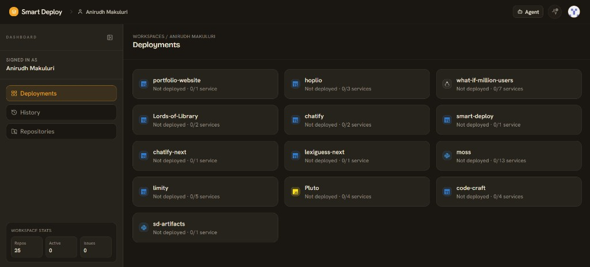
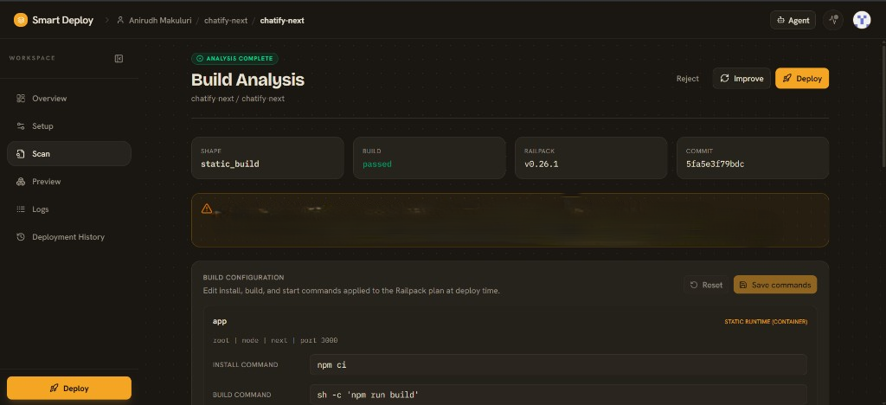
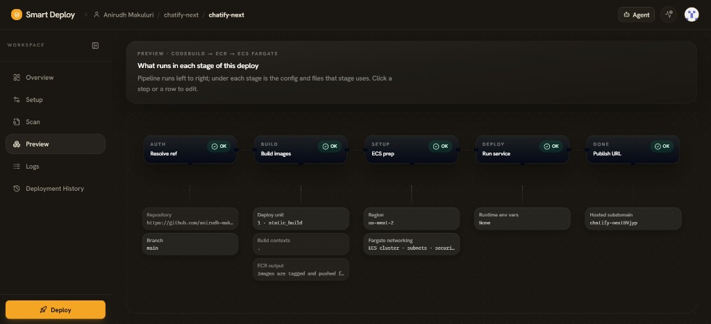

# SmartDeploy

### AI-Native AWS Deployment Platform

Currently built on ECS Fargate, Lambda, SQS, ECR, ALB, CloudWatch, Bedrock, and AWS Systems Manager.

| | |
|---|---|
| **Built by** | Makuluri Labs |
| **Founder** | Anirudh Makuluri |
| **Website** | [https://makuluri.com](https://makuluri.com) |

---

## Overview

SmartDeploy is an AI-native AWS deployment platform that analyzes GitHub repositories, generates deployment blueprints, automates production deployments, and includes an AI deployment agent and CLI for troubleshooting and operations.

Developers connect a GitHub repository, and SmartDeploy handles the full path from codebase analysis to live AWS infrastructure—without requiring manual cloud configuration.

---

## Why AWS?

AWS is the core platform behind SmartDeploy.

The platform currently leverages:

- Amazon ECS Fargate
- AWS Lambda
- Amazon SQS
- Amazon ECR
- Application Load Balancer
- Amazon S3
- Amazon CloudWatch
- AWS Systems Manager
- AWS IAM
- Amazon Bedrock

SmartDeploy uses Amazon SQS and AWS Lambda to decouple deployment execution from the control plane, allowing long-running deployments to execute asynchronously while keeping the application responsive.

Unlike a traditional SaaS application, SmartDeploy also provisions AWS infrastructure for its users. Every deployment executed through SmartDeploy creates and manages AWS resources on behalf of developers.

AWS Activate credits will allow us to:

- Scale deployment capacity
- Expand the AI Deployment Agent
- Expand the SmartDeploy CLI
- Perform larger-scale deployment and reliability testing
- Continue building production-grade AWS infrastructure while scaling SmartDeploy

---

## Product Highlights

### Repository Dashboard

SmartDeploy organizes repositories into deployment workspaces, automatically detects deployable services, and tracks deployment history across projects.

---

### AI Build Analysis

SmartDeploy analyzes GitHub repositories, validates build plans, detects deployment issues before deployment, and allows developers to modify deployment commands before execution.

---

### Deployment Blueprint

Before deployment, SmartDeploy generates a visual deployment blueprint showing every deployment stage, required AWS resources, networking configuration, runtime settings, and deployment flow.

This provides complete visibility into what will be created before any AWS resources are provisioned.

---

## Current Focus

SmartDeploy is actively expanding in the following areas:

- AI Deployment Agent
- SmartDeploy CLI
- Deployment Observability
- Automated Deployment Remediation
- Deployment Orchestration
- Scalable Deployment Infrastructure

---

## Current Status

- Bootstrapped and founder-funded
- Public product under active development
- AI-native AWS deployment platform
- Deploys customer applications directly onto AWS infrastructure
- Designed to simplify production deployments while providing complete deployment transparency

---

## Why AWS Activate?

SmartDeploy has been entirely self-funded to date, with AWS infrastructure costs covered personally during development. AWS Activate credits would accelerate product development by enabling larger-scale deployment testing, expanding the AI deployment agent and CLI, and continuing to build production-grade AWS infrastructure without constraining experimentation.

The long-term goal is to make SmartDeploy the simplest and most transparent way for developers to deploy production applications on AWS while providing an intelligent deployment agent that assists with deployment planning, troubleshooting, and operational workflows.
